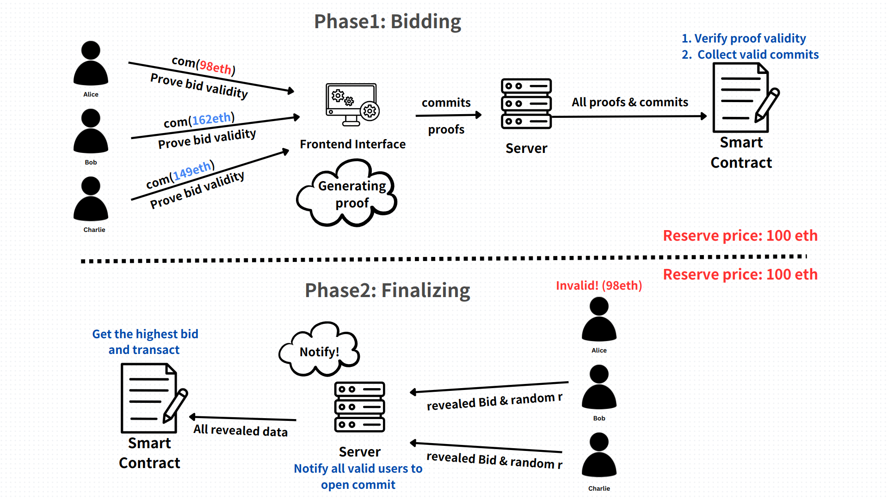

# Specification of project

## Introduction

構建出一個零知識拍賣系統，在 Deadline 之前各買家所投標之金額不會被得知(以 commitment 方式提交到 smart contract 上)，但在提交出 commitment 之前必須要證明它提交的金額大於底標，由 smart contract 驗證合法性，在過了 Deadline 之後就必須 open 當初的 commitment 讓 smart contract 決定出得標者(最高標)，再由 smart contract 處理後續的交易過程。



## User

#### Seller

-   only one person
-   set reserve price
-   set deadline
-   set product name

#### Bidder

-   could be many people
-   need to bid a valid amount
-   generate commitment for bid amount
-   generate proof for valid bid (greater than reserve price)
-   open the commitment after deadline

## Frontend

### 主頁面

提供一個可以讓 User 連接上它以太坊地址的界面

### 連接上後的頁面

#### 讓 User 選擇要當 Seller 或是 Bidder

-   選擇 Seller 後的頁面
    -   讓 Seller 可以拍賣商品，必須填入商品名、底標、Deadline
-   選擇 Bidder 後的頁面
    -   展示出所有現在正在拍賣的商品，選擇任一商品後可以進入對該商品出標的頁面
    -   再進入特定商品出標的頁面後必須填入出標金額，並產生對該金額的 commitment ，接著產生 zk proof 並將 commitment & proof 提交給後端

### Bid Commitment computation

在 Client 端先產產出一個 random number 再將出標金額及隨機數 r 一起計算 Hash

```c=
commiment = poseidon("Bid amount", r)
```

> 隨機數 r 要以某種形式在 Client 端儲存起來不能讓其他方知道，因為它隱藏了出標金額，但目前還不知道要怎麼存

## Backend

-   主頁面送出連接以太坊請求後要將此 client 連接到他的以太坊帳戶上
-   如果有 Seller 新增商品後要將該拍賣商品的所有資訊紀錄到合約上讓所有買家可以看到
-   在 User 選擇 Bidder 後的頁面列出現在合約上所有的可競標商品(還未到 Deadline)
-   Bidder 對特定商品出標後要將 commitment & proof 提交到合約上
-   當到 Deadline 時要通知所有出標者請他們 open 他們的金額，並觸發合約上的結標功能讓合約產生得標者

## Smart Contract

-   上面需要紀錄所有在拍賣的商品以及所有得出標 commitment 及 proof
-   要有函數接收來自 Seller 的新拍賣商品
-   要有函數來處理對特定商品得出標
-   要有函數可以在 Deadline 後被呼叫用來處理結標，當得到所有該商品的投標金額後(來自當初所有 commitment open 後的金額)決定出最高標，並與得標者進行後續交易

## ZK Circuit

### Private Input

-   使用者的隨機數 r
-   使用者得出標金額

### Public Input

-   底標
-   commitment
    > 產生 commitment 的 Hash funciton 默認是 poseidon

### 證明內容

-   出標金額及隨機數 r 所產生出的 Hash 確實等於 commitment
-   該出標金額大於底標
